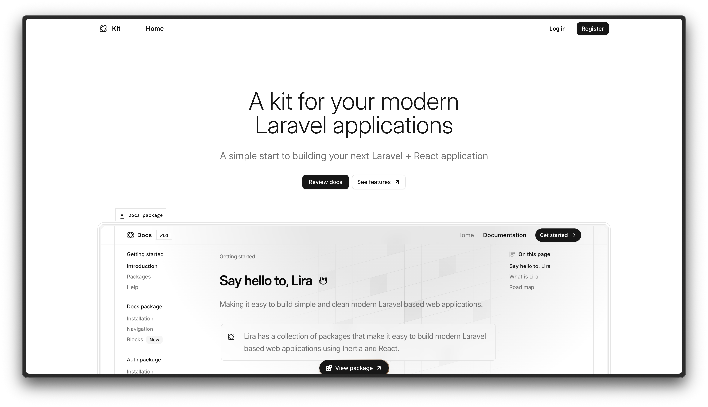

<p align="center"><a href="https://kit.liraui.com" target="_blank"></a></p>

# Starter kit

Lightweight starter kit built on Laravel, and React to get you started quickly

> ⚠️ Beta: This project is in BETA — APIs, file layout, and packages may change. Use for prototyping and early development. Report bugs or breaking changes in issues, please.

## What this starter kit provides

- Laravel application pre-wired with Inertia.js (React) and a set of LiraUi packages (auth, team, billing, etc.)
- Action / Contract / Response style backend patterns used by the packages
- Opinionated frontend components and layouts (Tailwind + shadcn-style components)
- Comes configured with the auth package. You can [read the documentation](https://liraui.com/docs) for full details on features, usage, and roadmap.

## Sail

```bash
git clone <repo-url> starter-kit

cd starter-kit

composer install

cp .env.example .env

php artisan key:generate

# Start services (Docker / Sail)
./vendor/bin/sail up -d

# Install frontend deps and run dev server (via Sail)
./vendor/bin/sail npm install
./vendor/bin/sail npm run dev

# Run migrations & seeders
./vendor/bin/sail artisan migrate --seed

# Visit: http://localhost (or APP_URL in .env)
```

If you prefer running on your host machine, replace `./vendor/bin/sail` with your platform's PHP & Node commands.

## Development notes

- Routes use attribute-based routing (Spatie route attributes). When controllers change, start Vite (`npm run dev`) to regenerate frontend route helpers.
- Wayfinder (Vite plugin) generates type-safe action helpers in `resources/js/actions`.

## Contributing

Bug reports and contributions are welcome — please open an issue or a pull request. Maintain a short description of breaking changes.

## License

The starter kit is open-sourced licensed under the MIT license.
